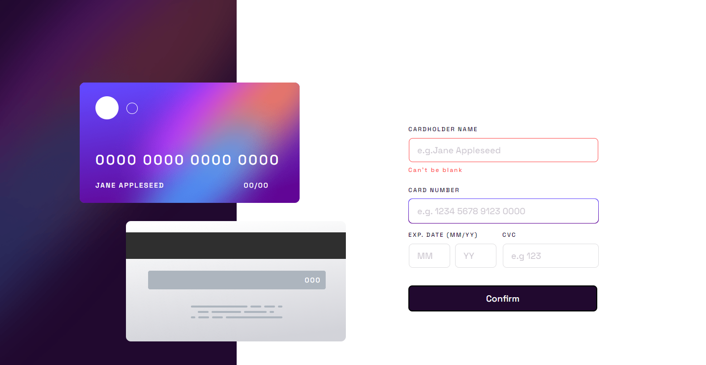

# Frontend Mentor - Interactive card details form solution

This is a solution to the [Interactive card details form challenge on Frontend Mentor](https://www.frontendmentor.io/challenges/interactive-card-details-form-XpS8cKZDWw). Frontend Mentor challenges help you improve your coding skills by building realistic projects. 

## Table of contents

- [Overview](#overview)
  - [The challenge](#the-challenge)
  - [Screenshot](#screenshot)
  - [Links](#links)
- [My process](#my-process)
  - [Built with](#built-with)
  - [What I learned](#what-i-learned)


## Overview

### The challenge

Users should be able to:

- Fill in the form and see the card details update in real-time
- Receive error messages when the form is submitted if:
  - Any input field is empty
  - The card number, expiry date, or CVC fields are in the wrong format
- View the optimal layout depending on their device's screen size
- See hover, active, and focus states for interactive elements on the page

### Screenshot




### Links

- Solution URL: [Add solution URL here](https://your-solution-url.com)
- Live Site URL: [Add live site URL here](https://your-live-site-url.com)

## My process

### Built with

- Semantic HTML5 markup
- CSS custom properties
- Flexbox
- Mobile-first workflow

### What I learned

One of the challenging parts of this project was getting the field border to highlight with a gradient, and only do it when selected.

I added code to Add and Remove the highlight onfocus and onblur 

```html
<input type="text" id="fname" name="cardholderName" placeholder="e.g.Jane Appleseed"
  onfocus="triggerHighlight('fname','fnameBorder')"
  onblur="removeHighlight('fname','fnameBorder','nameInputError')" onchange="updateCardName()">

```

I then used Javascript to toggle between the image and the border.  Additional logic to turn the border red when the field validation fails:

```js
function triggerHighlight(fieldId, fieldBorderId) {
  const formField = document.getElementById(fieldId)
  const formFieldBorder = document.getElementById(fieldBorderId)
  formField.style.border = '0.063rem solid transparent'
  formFieldBorder.style.backgroundImage = 'linear-gradient(#6348fe, #610595)'
}

function removeHighlight(fieldId, fieldBorderId, errorDisplayId) {
  const formField = document.getElementById(fieldId)
  const formFieldBorder = document.getElementById(fieldBorderId)

  let newBorderColor = '#dfdee0'
  let newErrorStatus = false

  let fieldError = getFieldError(fieldId)

  if (fieldError) {
    newBorderColor = '#FF5050'
  }

  formField.style.border = `0.063rem solid ${newBorderColor}`
  formFieldBorder.style.backgroundImage = 'none'

}
```

